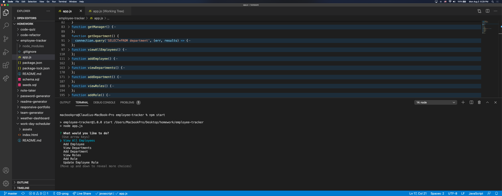

# employee-tracker

## Description
Command-line application that allows users to manage a company's employees using Node, Inquirer and MySQL

## Installation
Run npm install in terminal and schema.sql in MySQL

## Usage information
npm start

## License
MIT

## Contributing
Pull requests welcome

## Tests
N/A

## Questions ?
### https://github.com/cd-prog
### c.diaconeasa@gmail.com
